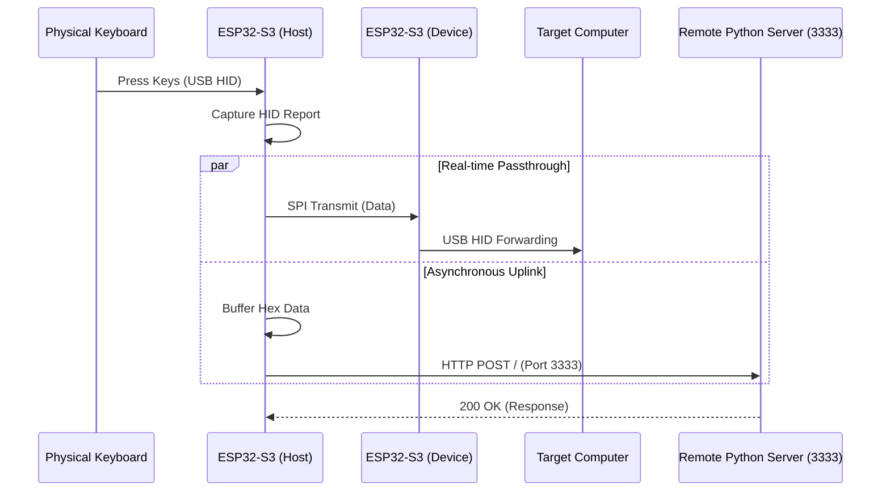
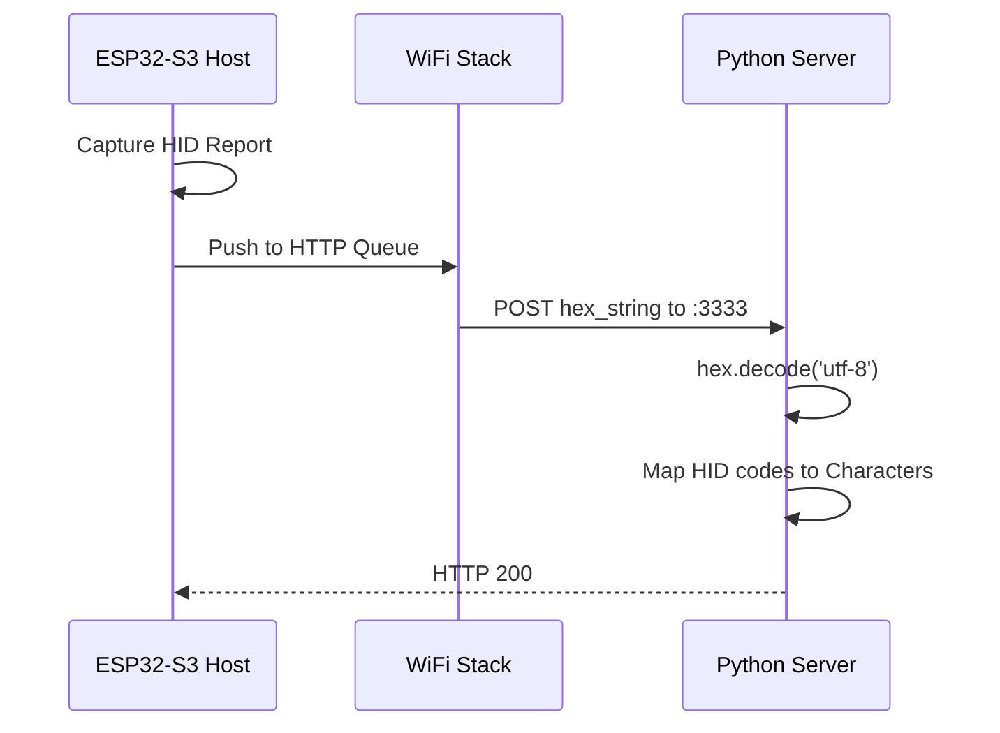

# Physical HID Network Logger with USB Passthrough

An ESP32-S3 powered USB HID Passthrough that captures keyboard/mouse data and uplinks it to a remote server via HTTP.

---

- 📡 **Network Uplink**: Real-time HID report forwarding to a remote Python server via HTTP POST.
- ⏰ **Low Latency**: Optimized dual-core processing ensuring sub-millisecond passthrough latency.
- ⌨️ / 🖱️ **1000Hz Support**: Fully compatible with high-polling rate gaming peripherals.
- 🛡️ **Hardware Stealth**: The PC sees a standard HID device, while data is silently exfiltrated over WiFi.
- 💾 **8MB PSRAM Optimized**: Custom pin mapping to support high-performance ESP32-S3 variants (like HW-678A).

---

## Overview

**macroPassthrough (Network Edition)** is a dual-ESP32-S3 project. It acts as a transparent bridge between USB peripherals and a PC. Unlike the original version, this fork **removes local macro injection** in favor of **WiFi connectivity** and **remote data logging**, allowing security researchers or developers to analyze HID traffic in real-time on a remote machine.

---

## New System Architecture




---

## Hardware Configuration (Critical)

Due to the **8MB PSRAM** on newer S3 boards, the SPI pins have been remapped to avoid memory access conflicts (Kernel Panics).

| Signal Group | Pins (GPIO) | Reason |
| :--- | :--- | :--- |
| **HID Data (SPI2)** | 11, 12, 13, 10 | Standard FSPI mapping, safe for PSRAM. |
| **LED Return (SPI3)** | 1, 2, 42, 41 | Avoids GPIO 33-37 (PSRAM range). |
| **Common Ground** | GND | Required for signal integrity. |

---

## Build & Usage

### 1. Server Setup
Run the included Python script on your remote machine to receive and decode HID data:
```bash
python3 server.py 
# Listening on port 3333...
```

### 2. Firmware Configuration
Edit `usb-input/main/config.h` to include your WiFi credentials and server IP:
```c
#define WIFI_SSID "Your_SSID"
#define WIFI_PASS "Your_Password"
#define SERVER_URL "http://192.168.1.100:3333/"
```

### 3. Build & Flash
```bash
cd usb-input && idf.py build flash
cd ../usb-output && idf.py build flash
```

---

## Key Changes from Original

1. **Macro Engine Removed**: To ensure zero-latency while maintaining a WiFi stack, the local macro processing was stripped.
2. **Task Decoupling**: 
    - **Core 0**: Dedicated to SPI and USB Host/Device tasks (Critical Path).
    - **Core 1**: Handles WiFi association and HTTP POST requests (Background Path).
3. **Data Format**: Reports are sent as 16-character hex strings representing the 8-byte HID standard (e.g., `00001e0000000000` for key '1').

---

## Developer Flow (Network Uplink)



---

## License

This project is a derivative work of [macroPassthrough](https://github.com/arfevrier/macroPassthrough), licensed under the **GPL-3.0 License**. All modifications, including the WiFi and HTTP modules, remain open source.